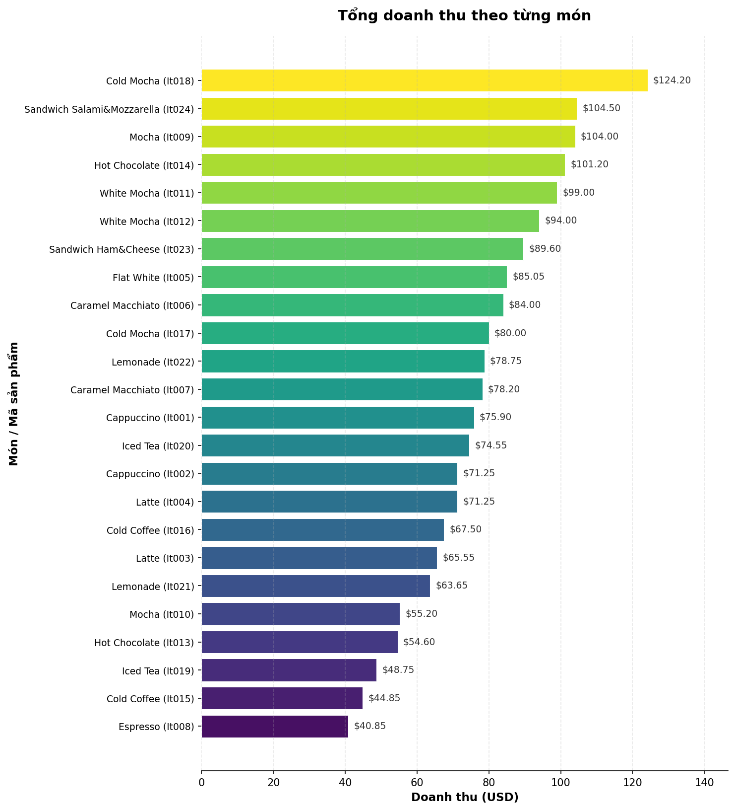
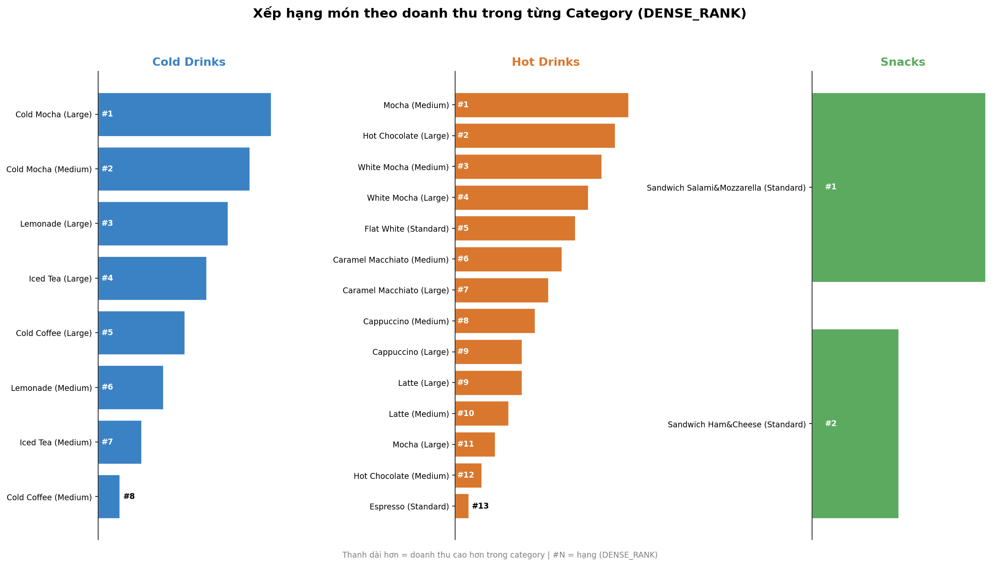
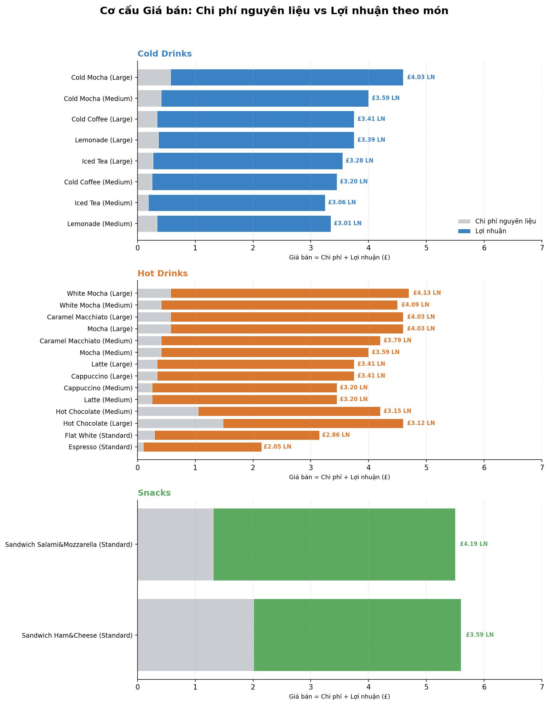
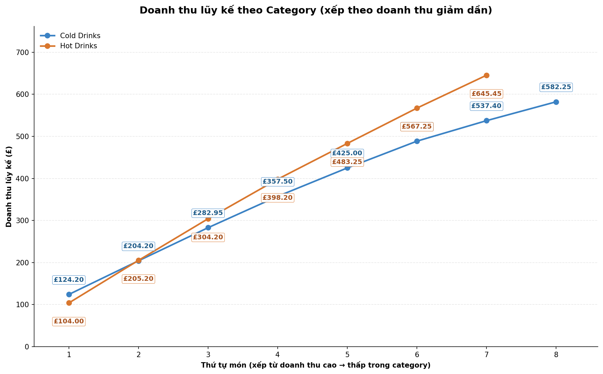

# ☕ Coffee Shop Cost Management & Optimization Analysis

## Introduction

Đây là một dự án phân tích dữ liệu (data analytics) được xây dựng nhằm mục đích thực hành và trình diễn các kỹ năng **làm sạch dữ liệu (data cleaning)**, **truy vấn SQL**, và **trực quan hóa dữ liệu (data visualization)** thông qua một bài toán thực tế: tối ưu hóa chi phí vận hành cho một quán cà phê (coffee shop).

Dự án mô phỏng vai trò của một Data Analyst được giao nhiệm vụ phân tích toàn bộ chuỗi dữ liệu kinh doanh của quán — từ doanh thu, chi phí nguyên liệu, hiệu suất nhân viên cho đến tình trạng tồn kho — để trả lời các câu hỏi kinh doanh cốt lõi và đưa ra khuyến nghị giúp cải thiện lợi nhuận.

Toàn bộ quy trình được thực hiện theo từng bước, đi từ dữ liệu thô (raw data) đến báo cáo trực quan hoàn chỉnh, nhằm thể hiện rõ tư duy phân tích và khả năng xử lý dữ liệu end-to-end — một yếu tố quan trọng khi xây dựng portfolio cá nhân.

> 🔍 Bạn có thể xem chi tiết các câu truy vấn SQL tại đây: [project_sql folder](/Project_sql/)

## Background

Dữ liệu được sử dụng trong dự án này là bộ **Coffee Shop Sales/Inventory/Staff dataset** (nguồn: [Kaggle](https://www.kaggle.com/datasets/viramatv/coffee-shop-data)), bao gồm 8 bảng dữ liệu có quan hệ với nhau (multi-table relational structure):
 bao gồm 8 bảng dữ liệu có quan hệ với nhau (multi-table relational structure):

| Bảng | Mô tả | Số dòng |
|---|---|---|
| `items` | Danh mục sản phẩm (đồ uống/đồ ăn) của quán | 24 |
| `orders` | Lịch sử đơn hàng đã bán | 466 |
| `recipes` | Công thức pha chế — nguyên liệu cần cho từng sản phẩm | 61 |
| `ingredients` | Danh mục nguyên liệu, đơn giá, khối lượng | 18 |
| `inventory` | Tồn kho nguyên liệu hiện tại | 18 |
| `staff` | Thông tin nhân viên, lương theo giờ | 4 |
| `shift` | Các ca làm việc trong tuần | 11 |
| `rota` | Lịch phân ca thực tế của từng nhân viên | 17 |

Động lực để thực hiện dự án xuất phát từ một bài toán kinh doanh rất phổ biến trong ngành F&B: **làm sao để quản lý chi phí hiệu quả hơn** khi biên lợi nhuận trên mỗi sản phẩm thường khá mỏng và phụ thuộc nhiều vào giá nguyên liệu, lãng phí tồn kho, và hiệu suất nhân sự. Dự án đặt ra các câu hỏi nghiên cứu xoay quanh bốn mảng kinh doanh chính:

- **Doanh thu (Revenue):** Sản phẩm nào mang lại doanh thu cao nhất? Xếp hạng sản phẩm theo doanh thu trong từng danh mục như thế nào?
- **Chi phí (Cost):** Chi phí nguyên liệu thực tế cho mỗi sản phẩm là bao nhiêu? Sản phẩm nào có biên lợi nhuận (margin) cao/thấp nhất?
- **Nhân sự (Staff):** Mỗi nhân viên đã làm bao nhiêu ca trong kỳ?
- **Tồn kho (Inventory):** Nguyên liệu nào đang ở mức tồn kho thấp? Tỷ lệ phần trăm nguyên liệu đã tiêu thụ so với tồn kho ban đầu là bao nhiêu?
- **Insight kinh doanh:** Xu hướng doanh thu lũy kế (cumulative revenue) theo thời gian diễn biến ra sao?

## Tools I Used

Để thực hiện dự án phân tích này một cách toàn diện, tôi đã sử dụng kết hợp các công cụ sau:

- **Microsoft Excel:** Dùng để khám phá và làm sạch dữ liệu thô ban đầu (data cleaning) — xử lý các vấn đề như ký tự ẩn, dữ liệu mồ côi (orphaned records), định dạng sai kiểu dữ liệu, trước khi đưa vào cơ sở dữ liệu.
- **SQL (PostgreSQL):** Ngôn ngữ truy vấn cốt lõi giúp tôi thiết lập cấu trúc quan hệ giữa các bảng (foreign keys), đồng thời thực hiện các truy vấn phân tích phức tạp — từ JOIN nhiều bảng, window functions (`RANK`, `DENSE_RANK`), đến các phép tính tổng hợp phục vụ việc trả lời các câu hỏi kinh doanh.
- **VSCode + SQLTools Extension:** Môi trường làm việc chính để viết, kiểm thử và quản lý các câu lệnh SQL kết nối trực tiếp tới PostgreSQL.
- **Python (Pandas, Matplotlib, Seaborn):** Dùng để xử lý kết quả truy vấn và xây dựng các biểu đồ trực quan hóa chuyên nghiệp, hỗ trợ việc trình bày insight một cách rõ ràng, dễ hiểu.
- **Git & GitHub:** Dùng để quản lý phiên bản (version control) và đóng gói toàn bộ dự án thành một portfolio có thể chia sẻ công khai.

## The Analysis

*(Phần này sẽ được bổ sung chi tiết sau)*

### Excel (Data Cleaning)

- **BEFORE:** [coffee_shop_raw](excel_file/coffee_shop_raw.xlsx)

- **AFTER:** [coffeeShop_Clean](excel_file/CoffeeShop_Clean.xlsx)

Trước khi import vào PostgreSQL, dữ liệu thô được làm sạch trực tiếp trên Excel với các thao tác chính sau:


**Bảng `orders`:**
- Dùng *Find & Replace* để xóa khoảng trắng thừa trong cột `in_or_out`.
- Tạo cột phụ đếm số ký tự (`LEN`) để kiểm tra tính hợp lệ của `item_id` (chuẩn 5 ký tự) → phát hiện và sửa lỗi `It0010` → `It001` tại `row_id` 45.
- Chuyển toàn bộ giá trị rỗng (null) trong cột `in_or_out` thành `'unknown'`.
- Dùng công cụ *Data Clean-up* để xóa dòng trùng lặp (duplicate) và khoảng trắng thừa (TRIM) — loại trừ cột ID khi thực hiện để tránh ảnh hưởng đến khóa dữ liệu.

**Bảng `items`:**
- Xóa khoảng trắng thừa trong tên cột `item_price`.
- Chuyển `item_price` từ dạng text sang số, đồng thời thêm cột `currency` (£).

**Xử lý dữ liệu mồ côi (orphaned records):**
- Các `item_id` (`It025`–`It028`) xuất hiện trong `orders` nhưng không tồn tại trong `items` → xóa trực tiếp trên Excel trước khi import.
- `SH012` xuất hiện trong `rota` nhưng không tồn tại trong `shift` → xóa trực tiếp trên Excel trước khi import.

### SQL (Data Processing)

Sau khi import vào PostgreSQL, bước đầu tiên là thiết lập lại quan hệ khóa ngoại còn thiếu giữa hai bảng `items` và `recipes` (liên kết qua `sku` ↔ `recipe_id`), để đảm bảo tính toàn vẹn dữ liệu trước khi truy vấn:

```sql
-- Thiết lập Foreign Key: items.sku = recipes.recipe_id
ALTER TABLE items
ADD CONSTRAINT uq_items_sku UNIQUE (sku);

ALTER TABLE recipes
ADD CONSTRAINT fk_recipes_items
FOREIGN KEY (recipe_id)
REFERENCES items(sku);
```

Sau đó, các truy vấn phân tích được chia theo từng mảng kinh doanh như sau:

#### 1. Doanh thu (Revenue)

**a) Tổng doanh thu theo từng món (không tính size)**

```sql
SELECT 
    it.item_id,
    it.item_name as Ten_Mon, 
    SUM(it.item_price* od.quantity) as Doanh_Thu
FROM 
    orders od
INNER JOIN items it ON od.item_id = it.item_id
GROUP BY  
    it.item_id, it.item_name
ORDER BY 
    Doanh_Thu DESC
```



**b) Xếp hạng món theo doanh thu trong từng category**

Sử dụng `DENSE_RANK()` để xếp hạng các món trong cùng một danh mục (`item_cat`) theo doanh thu giảm dần; giá trị `item_size = 'N/A'` được chuẩn hóa thành `'Standard'` bằng `CASE WHEN`.

```sql
WITH Tong_Doanh_Thu_Tung_Mon AS (
    SELECT 
        it.item_cat AS Category,
        it.item_id,
        it.item_name AS Ten_Mon, 
        CASE 
            WHEN it.item_size = 'N/A' THEN 'Standard'
            ELSE it.item_size 
        END AS Kich_Thuoc,
        SUM(it.item_price * od.quantity) as Doanh_Thu
    FROM 
        orders od
    INNER JOIN items it ON od.item_id = it.item_id
    GROUP BY  
        it.item_cat, it.item_id, it.item_name, it.item_size
)
SELECT 
    Category,
    Ten_Mon,
    Kich_Thuoc,
    DENSE_RANK() OVER(
        PARTITION BY Category
        ORDER BY Doanh_Thu DESC ) AS Xep_Hang_Cat
FROM 
    Tong_Doanh_Thu_Tung_Mon
ORDER BY 
    Category, Xep_Hang_Cat;
```


#### 2. Chi phí (Cost)

**a) Chi phí nguyên liệu của từng món**

Chi phí được tính bằng cách chuẩn hóa theo khối lượng nguyên liệu thực tế sử dụng (`quantity × (ing_price / ing_weight)`), thay vì nhân trực tiếp số lượng với đơn giá nguyên liệu.

```sql
SELECT 
    it.item_name AS Ten_Mon,
    it.item_cat AS Category,
    CASE 
            WHEN it.item_size = 'N/A' THEN 'Standard'
            ELSE it.item_size 
        END AS Kich_Thuoc,
    round(SUM(rs.quantity * (ig.ing_price / ig.ing_weight)),2) AS Phi_Nguyen_Lieu
FROM items it
INNER JOIN recipes rs ON it.sku = rs.recipe_id
INNER JOIN ingredients ig ON rs.ing_id = ig.ing_id
GROUP BY it.item_cat, it.item_name, it.item_size
ORDER BY it.item_cat
```

**b) Món có biên lợi nhuận (margin) cao nhất / thấp nhất**

Sử dụng CTE để tính lợi nhuận (`giá bán − chi phí nguyên liệu`), sau đó xếp hạng bằng `DENSE_RANK()` theo từng category.

```sql
WITH Phi_Nguyen_Lieu AS (
SELECT 
    it.item_name    AS Ten_Mon,
    it.item_cat     AS Category,
    CASE 
            WHEN it.item_size = 'N/A' THEN 'Standard'
            ELSE it.item_size 
        END AS Kich_Thuoc,
    round(SUM(rs.quantity * (ig.ing_price / ig.ing_weight)),2) AS Phi_Nguyen_Lieu,
    it.item_price AS Gia_Ban,
    it.item_price - round(SUM(rs.quantity * (ig.ing_price / ig.ing_weight)),2) as Loi_Nhuan
FROM items it
INNER JOIN recipes rs ON it.sku = rs.recipe_id
INNER JOIN ingredients ig ON rs.ing_id = ig.ing_id
GROUP BY it.item_cat, it.item_name, it.item_size, Gia_Ban
ORDER BY it.item_cat
)
SELECT 
    Category,
    Ten_Mon,
    Kich_Thuoc,
    Gia_Ban,
    Phi_Nguyen_Lieu,
    Loi_Nhuan,
    DENSE_RANK() OVER (PARTITION BY Category ORDER BY 
        (Gia_Ban - Phi_Nguyen_Lieu) DESC)  AS Rank_Cao_Nhat
FROM Phi_Nguyen_Lieu
ORDER BY Category, Rank_Cao_Nhat
```


#### 3. Nhân sự (Staff)

**Số ca làm việc của từng nhân viên**

```sql
SELECT 
   CONCAT(first_name,' ', last_name) AS Ten_Nhan_Vien,
   st.staff_id,
   COUNT(rt.shift_id) AS So_Ca_Lam_Viec
FROM rota rt
INNER JOIN staff st ON rt.staff_id = st.staff_id 
GROUP BY 
    st.first_name, st.last_name, st.staff_id
```


#### 4. Đơn hàng (Orders)

**Số lượng đơn hàng dùng tại chỗ (in) / mang đi (out) / không xác định (unknown) theo từng ngày**

```sql
SELECT
    TO_CHAR(created_at, 'dd-mm') as Ngay,
    TO_CHAR(created_at, 'day') as Thu,
    COUNT(in_or_out) AS Tong,
    SUM(CASE WHEN in_or_out= 'in' THEN quantity END) AS So_Luong_IN,
    SUM(CASE WHEN in_or_out= 'out' THEN quantity END) AS So_Luong_OUT,
    SUM(CASE WHEN in_or_out= 'unknown' THEN quantity END) AS So_Luong_UNKNOWN    
FROM
    orders
GROUP BY
    Ngay, Thu
ORDER BY
    Ngay
```


#### 5. Insight kinh doanh — Doanh thu lũy kế (Running Total)

Tính doanh thu lũy kế (cumulative) theo từng category, sắp xếp theo doanh thu giảm dần, sử dụng window function `SUM() OVER()`.

```sql
WITH Tong_Doanh_Thu_Tung_Mon AS (
    SELECT 
        it.item_cat AS Category,
        it.item_id,
        it.item_name AS Ten_Mon, 
        CASE 
            WHEN it.item_size = 'N/A' THEN 'Standard'
            ELSE it.item_size 
        END AS Kich_Thuoc,
        SUM(it.item_price * od.quantity) as Doanh_Thu
    FROM 
        orders od
    INNER JOIN items it ON od.item_id = it.item_id
    GROUP BY  
        it.item_cat, it.item_id, it.item_name, it.item_size
)
SELECT 
    Category,
    SUM(Doanh_Thu) OVER(
        PARTITION BY Category
        ORDER BY Doanh_Thu DESC ) AS Luy_Ke_Doanh_Thu_Tung_Mon
FROM 
    Tong_Doanh_Thu_Tung_Mon
ORDER BY 
    Category, Luy_Ke_Doanh_Thu_Tung_Mon;
```


## Insight

Từ kết quả các truy vấn SQL trên, một số phát hiện chính:

- **Doanh thu lệch về Hot Drinks**: chiếm >58% tổng doanh thu (£1,080/£1,856), gấp ~2 lần Cold Drinks, Snacks chỉ ~10% → quán còn phụ thuộc nhiều vào đồ uống nóng, rủi ro khi vào mùa hè.
- **Margin cao nhưng không đều**: trung bình ~87.5%, trong đó Snacks thấp nhất (~70%) do chi phí nguyên liệu cao hơn (thịt nguội, phô mai). *Espresso* có margin tuyệt đối thấp nhất nhưng tỷ suất lợi nhuận vẫn tốt, nên giữ làm món "mồi" thu hút khách.
- **Phân ca nhân sự khá cân bằng**: 4 nhân viên đều làm 4–5 ca/người, không ai bị quá tải.
- **~17% đơn hàng thiếu thông tin in/out** — đây là vấn đề chất lượng dữ liệu đầu vào cần cải thiện ở khâu order, hơn là insight kinh doanh.
- **Doanh thu lũy kế** cho thấy hiệu ứng 80/20: chỉ vài món "ngôi sao" đầu mỗi category đã đóng góp phần lớn doanh thu của nhóm đó.

## Conclusions

Dự án hoàn thành đầy đủ chu trình phân tích: làm sạch dữ liệu trên Excel → xây dựng database PostgreSQL → truy vấn SQL → rút insight kinh doanh.

**Về kinh doanh**, quán nên: đa dạng hóa Cold Drinks/Snacks để giảm phụ thuộc mùa vụ, xem lại giá/công thức các món margin thấp (Espresso, Flat White), cải thiện ghi nhận đơn hàng để giảm dữ liệu "unknown".

**Về kỹ thuật**, dự án giúp thực hành làm sạch dữ liệu bẩn, thiết kế quan hệ đa bảng, và viết SQL nâng cao (CTE, `DENSE_RANK()`, `SUM() OVER()`) — thể hiện rõ quy trình end-to-end từ raw data đến insight. Hướng mở rộng tiếp theo: phân tích tồn kho (mức tồn thấp, % tiêu thụ) và xây dashboard trực quan tương tác.


